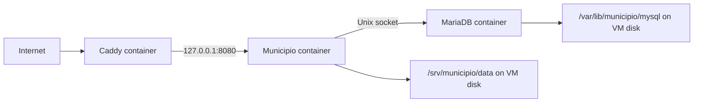
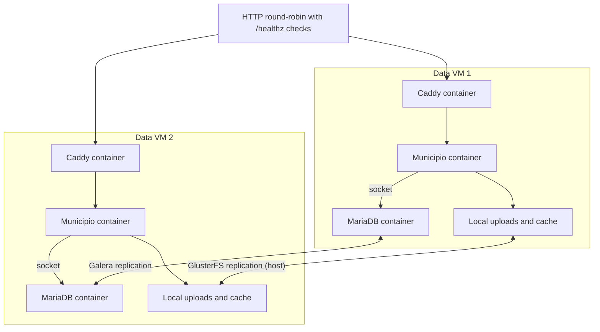

# Architecture

## Goal

Run the same Municipio image used in larger environments without introducing an orchestration platform. Every data VM owns its compute, database, and filesystem copy. Only state replication crosses VM boundaries.

Every long-running service — application, database and web server — runs as a digest-pinned container. The host provides a container runtime, and in cluster mode a replicated filesystem.

## Standalone

There is no cluster software in the data path. Failure recovery uses backups or VM-level recovery.

## Two data nodes

The HTTP round-robin layer is outside this repository. It must health-check `/healthz`. It never handles database traffic.

## How the application reaches its database

Each application container connects to the MariaDB container on its own VM through a shared Unix socket. `DB_SOCKET_DIR` is bind-mounted read-write into the database container and read-only into the application container, both at `/run/mysqld`.

`DB_HOST=localhost:/run/mysqld/mysqld.sock` is therefore unchanged from the host-installed design. It is not a remote or shared database address, port 3306 is not published, and the application container is not attached to any Docker network the database can be reached on.

## Container network placement

| Service | Network | Why |
| --- | --- | --- |
| MariaDB | Host namespace | Keeps `bind-address`, the port matrix and Galera replication identical to a host-installed server. |
| Caddy | Host namespace | Owns 80/443 directly, sees real client addresses, reaches the local application over loopback in both runtime modes. |
| Municipio | Private bridge | Published only on `127.0.0.1:8080`. Reaches the database by socket, not by network. |

Sharing the host namespace for two of the three containers is a deliberate trade. It gives up network isolation between those containers and their own VM, and in exchange the security boundary, the firewall policy and the cluster replication behaviour are the ones that were already reviewed — which matters most on the cluster path, the least-tested part of this repository.

## State ownership

| State | Owner | Synchronization |
| --- | --- | --- |
| Application code | Docker image | Every node pulls the same digest. |
| Database engine | Docker image | Every node pulls the same digest. |
| Web server | Docker image | Every node pulls the same digest. |
| WordPress database | Local MariaDB container, `DB_DATA_ROOT` on VM disk | Galera in cluster modes. |
| Uploads | Local VM disk | GlusterFS in cluster modes. |
| File caches | Local VM disk | GlusterFS in cluster modes. |
| TLS certificates | `caddy_data` named volume | Per node. Not replicated. |
| Configuration | Local root-owned file | Generated by the interactive installer on each VM. |
| Logs | Local service/container | External collection is optional and out of scope. |
| Backups | Local initially | Must be copied off the VM for real disaster recovery. |

`DB_DATA_ROOT` must never be placed on GlusterFS or copied with rsync. `validate_config` refuses a value inside `DATA_ROOT` or `GLUSTER_BRICK`.

## Consistency and availability

Two voters cannot safely distinguish host failure from a network partition. `cluster-manual` therefore prefers Node 1 and requires fencing before Node 2 can be promoted. `cluster-arbitrator` adds a third vote without adding a third full data copy.

Database and filesystem health are evaluated together. A node is removed from HTTP service when either side loses safe writable state.

Health evaluation stays on the host, because its cluster checks read the host's mount table. See [Caddy and health](components/proxy-health.md).

## Galera bootstrap has explicit state

A container cannot apply `--wsrep-new-cluster` to exactly one start the way the distribution's `galera_new_cluster` helper did. Bootstrapping therefore sets a marker that `status.municipio.sh` keeps reporting, and `cluster.municipio.sh clear-bootstrap-flag` removes it once the peer has joined. See [MariaDB and Galera](components/database.md).

## Container execution

`DOCKER_SWARM=0` uses Docker Compose on each VM. `DOCKER_SWARM=1` creates one Swarm spanning both data VMs in cluster mode, and Swarm manages the **application only** — MariaDB and Caddy remain per-VM Compose services, because both own node-local state that must never be rescheduled. A global service runs one application task per enabled data VM, using that VM's MariaDB socket and local Gluster mount.
