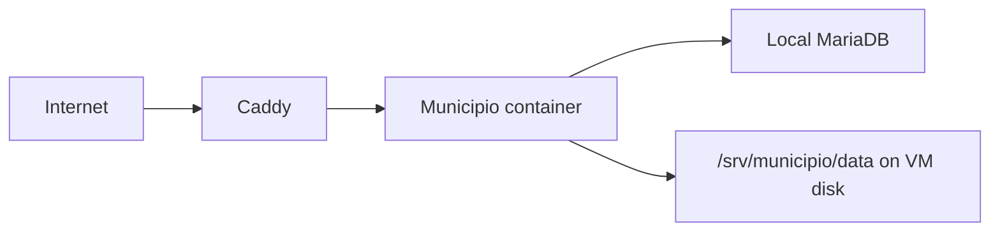
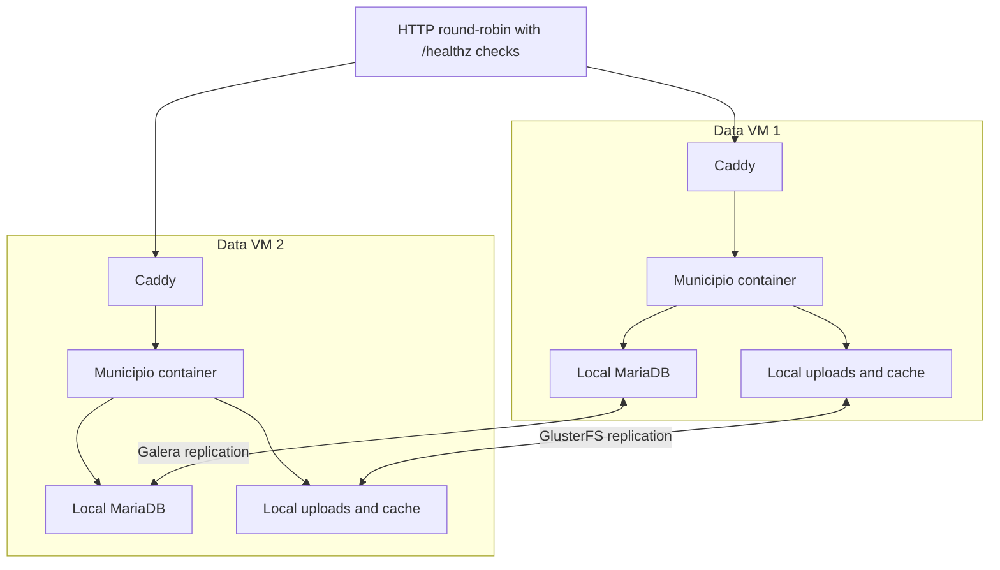

# Architecture

## Goal

Run the same Municipio image used in larger environments without introducing an orchestration platform. Every data VM owns its compute, database, and filesystem copy. Only state replication crosses VM boundaries.

## Standalone

There is no cluster software in the data path. Failure recovery uses backups or VM-level recovery.

## Two data nodes

The HTTP round-robin layer is outside this repository. It must health-check `/healthz`. It never handles database traffic.

Each application connects to MariaDB on its own VM through the local Unix socket mounted read-only into the container. `DB_HOST=localhost:/run/mysqld/mysqld.sock` is not a remote or shared database address, and port 3306 does not need to be exposed.

## State ownership

| State | Owner | Synchronization |
| --- | --- | --- |
| Application code | Docker image | Every node pulls the same digest. |
| WordPress database | Local MariaDB | Galera in cluster modes. |
| Uploads | Local VM disk | GlusterFS in cluster modes. |
| File caches | Local VM disk | GlusterFS in cluster modes. |
| Configuration | Local root-owned file | Generated by the interactive installer on each VM. |
| Logs | Local service/container | External collection is optional and out of scope. |
| Backups | Local initially | Must be copied off the VM for real disaster recovery. |

MariaDB's data directory must never be placed on GlusterFS or copied with rsync.

## Consistency and availability

Two voters cannot safely distinguish host failure from a network partition. `cluster-manual` therefore prefers Node 1 and requires fencing before Node 2 can be promoted. `cluster-arbitrator` adds a third vote without adding a third full data copy.

Database and filesystem health are evaluated together. A node is removed from HTTP service when either side loses safe writable state.

## Container execution

`DOCKER_SWARM=0` uses Docker Compose on each VM. `DOCKER_SWARM=1` creates one Swarm spanning both data VMs in cluster mode. A global service runs one task per enabled data VM. Each task uses that VM's MariaDB socket and local Gluster mount.
